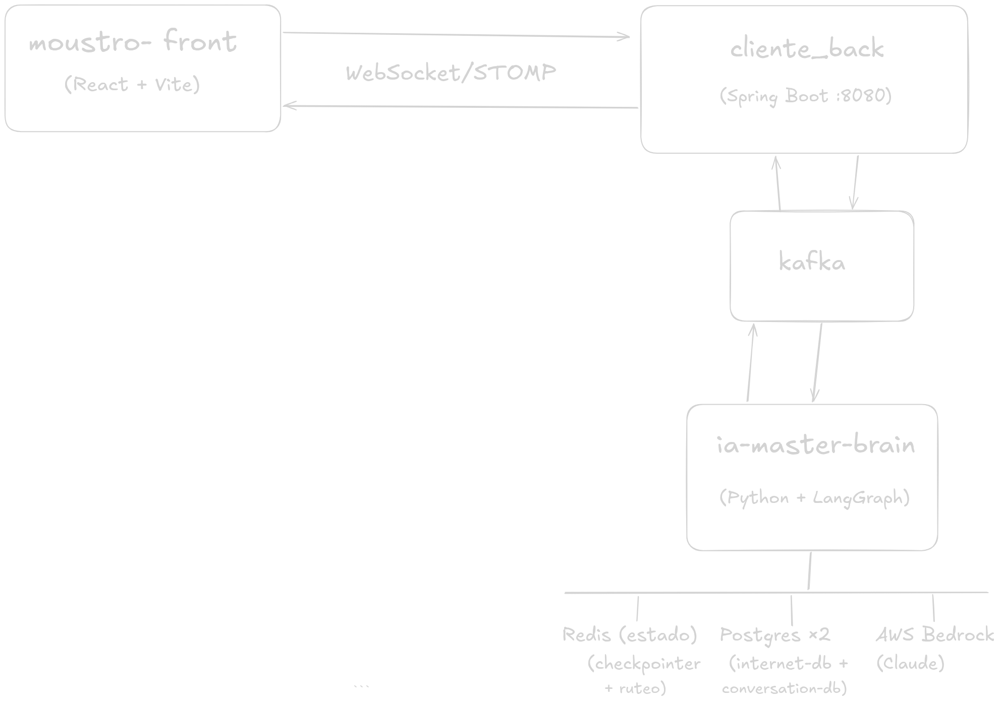

# Mounstro v3 — Agente de Atención al Cliente con IA

Sistema de atención al cliente conversacional para una empresa de telecomunicaciones. Integra un chat en tiempo real (WebSocket/STOMP), un agente LLM orquestado con LangGraph y tres flujos de trabajo especializados e independientes, con memoria de corto y largo plazo.

**Repositorio:** https://github.com/facuvgaa/agent-internet-ia

---

## Diagrama de arquitectura



---

## Arquitectura general

```
┌─────────────────┐   WebSocket/STOMP   ┌────────────────────────┐
│  moustro-front  │ ◄──────────────────► │    cliente_back        │
│  (React + Vite) │                      │  (Spring Boot :8080)   │
└─────────────────┘                      └───────────┬────────────┘
                                                     │  Kafka
                                          ┌──────────▼────────────┐
                                          │    ia-master-brain    │
                                          │                       │
                                          │  ┌─── Triage (Haiku)  │
                                          │  │   CONSULTA │ RECLAMO│
                                          │  │            ▼       │
                                          │  │       LlmBrain     │
                                          │  │    ┌──────────────┐ │
                                          │  │    │   billing    │ │
                                          │  │    │   promise    │ │
                                          │  │    │   retention  │ │
                                          │  │    └──────────────┘ │
                                          └──────────┬────────────┘
                                                     │
                              ┌──────────────────────┼──────────────────────┐
                         Redis (corto plazo)    Postgres ×2           AWS Bedrock
                         checkpointer +         internet-db +          (Claude)
                         ruteo activo           conversation-db
                                                (largo plazo)
```

### Flujo de un mensaje

1. El usuario escribe en el **chat (React)** → publica en `/app/chat` por STOMP.
2. **Spring Boot** publica el mensaje en Kafka topic `consultas.usuario`.
3. **ia-master-brain** consume el mensaje:
   - Si es la **primera vez** del cliente → **Haiku hace triage** (`CONSULTA` o `RECLAMO`).
   - Si ya tiene ruta guardada en Redis → va directo sin triage.
4. Las `CONSULTA` son respondidas por Haiku directamente (preguntas generales sin acceso a datos).
5. Los `RECLAMO` van al `LlmBrain` que invoca el subgrafo LangGraph correspondiente.
6. El subgrafo llama a las APIs REST de Spring Boot (facturas, tickets, retención, etc.).
7. La respuesta se publica en Kafka `respuestas.agente`.
8. Spring Boot la entrega al frontend por WebSocket (`/user/{customerId}/queue/chat`).

---

## Sistema de triaje (consumer)

El consumer tiene dos caminos completamente separados antes de invocar el agente completo:

```python
# Primera vez → triage con Haiku (liviano, sin estado)
CONSULTA → Haiku responde directamente (sin herramientas, sin LangGraph)
RECLAMO  → set_route("BRAIN") → LlmBrain (LangGraph + tools)

# Mensajes siguientes → ruta ya guardada en Redis (sin volver a clasificar)
route == "BRAIN"    → procesar_brain()
route == "CONSULTA" → responder_consulta()
```

Esto evita correr el agente completo para preguntas simples como "¿cuál es el horario de atención?" y reduce significativamente la latencia y el costo.

---

## Memoria de corto y largo plazo

El sistema implementa una estrategia de memoria en dos niveles:

### Corto plazo — Redis (sesión activa)

- **Checkpointer LangGraph** en Redis almacena el estado completo de cada subgrafo (mensajes, `paso_actual`, datos del cliente, ofertas, etc.) con el thread_id `{flujo}-{customer_id}`.
- **Ruteo activo** en Redis `db=1` con TTL de 24 hs: sabe si el cliente está en `BRAIN` o `CONSULTA` sin necesidad de reclasificar en cada mensaje.
- Si Redis no está disponible, cae automáticamente a `MemorySaver` (en memoria del proceso).

### Largo plazo — PostgreSQL (`conversation-db`)

- Al finalizar una conversación general, los mensajes se **persisten en Postgres** (`conversation_history`).
- En la próxima sesión, si Redis ya no tiene el estado, se **recuperan los últimos 5 mensajes** de Postgres como contexto inicial.
- Esto da continuidad entre sesiones: el agente "recuerda" interacciones anteriores del cliente.

```
Nueva sesión
     ↓
¿Redis tiene estado?  →  Sí → usar directamente (sesión caliente)
     ↓ No
¿Postgres tiene historial? → Sí → cargar últimos 5 mensajes como contexto
     ↓ No
Conversación nueva sin historial
```

---

## Flujos LangGraph — Independientes y conectados

Los tres subgrafos son **completamente independientes**: cada uno tiene su propio estado (`TypedDict`), sus nodos, sus routers y su checkpointer en Redis con thread_id separado. Sin embargo, **se pueden conectar entre sí** mediante el estado del grafo de billing:

```
LlmBrain (orquestador)
    │
    ├── billing ──► [paso_actual = "ir_a_promise"]  ──► promise
    │                [paso_actual = "ir_a_retention"] ──► retention
    │
    ├── promise  (entrada directa o desde billing)
    │
    └── retention (entrada directa, desde billing, o desde info_servicios)
```

Cada subgrafo termina siempre en `END` y preserva su estado en Redis. El orquestador decide en cada mensaje a cuál subgrafo derivar verificando el `paso_actual` de cada uno.

### Subgrafo Billing

Gestiona facturas, reclamos de pagos y derivaciones.

```
dispatcher → cargar_datos → conversar
                                ├─ [reclamo]     → gestionar_reclamo → END
                                ├─ [servicios]   → info_servicios
                                │                      ├─ [retention] → marcar_retention → END
                                │                      └─ [end]       → END
                                ├─ [ir_a_promise]  → marcar_promise → END
                                ├─ [ir_a_retention] → marcar_retention → END
                                └─ END
```

El `dispatcher` evita re-ejecutar `cargar_datos` si el cliente ya está en medio de un reclamo (`esperando_datos_reclamo`) o consultando servicios (`info_servicios`).

### Subgrafo Retention

Negocia descuentos y aplica acuerdos de retención.

```
dispatcher → cargar_datos → generar_oferta → negociar → END
    │              │               │              │
    │         (eligibility)  (preview por    (LLM negocia
    │                          servicio)      con cliente)
    │
    ├─ [acepta] → aplicar → END   (aplica todos los servicios de ofertas_preview)
    └─ [rechaza] → END
```

El `dispatcher` detecta aceptación/rechazo **antes** de llamar a `nodo_negociar`, evitando loops. Al aceptar, aplica directamente todas las ofertas de `ofertas_preview` sin depender del LLM para extraer service_ids.

### Subgrafo Promise

Gestiona promesas de pago para reactivar servicios.

```
cargar_datos → explicacion_promesa → ejecutar_promesa → END
```

El router `router_explicacion` espera confirmación explícita del cliente antes de ejecutar la promesa.

---

## Servicios

| Servicio | Tecnología | Puerto |
|---|---|---|
| `moustro-front` | React + Vite + nginx | 80 |
| `cliente_back` | Spring Boot 3 / Java 21 | 8080 |
| `ia_brain` | Python 3.12 + LangGraph | — (worker) |
| `kafka` | Confluent Kafka 7.5 | 9092 |
| `postgres` (`internet-db`) | PostgreSQL 15 | 5432 |
| `postgrest` (`conversation-db`) | PostgreSQL 15 | 5433 |
| `redis` | Redis Stack | 6379 |

---

## Prerrequisitos

- [Docker](https://docs.docker.com/get-docker/) y [Docker Compose](https://docs.docker.com/compose/) v2
- Credenciales de **AWS Bedrock** con acceso a los modelos `claude-3-haiku` y `claude-sonnet-4-6`

---

## Primeros pasos

### 1. Clonar el repositorio

```bash
git clone https://github.com/facuvgaa/agent-internet-ia.git
cd agent-internet-ia
```

### 2. Configurar variables de entorno

```bash
cp .env.example .env
```

Editá `.env` y completá las credenciales AWS:

```env
AWS_ACCESS_KEY_ID=tu_access_key
AWS_SECRET_ACCESS_KEY=tu_secret_key
AWS_REGION=us-east-1
```

### 3. Levantar todo

```bash
docker compose up --build
```

El primer build tarda varios minutos (Maven descarga dependencias, npm compila). Los siguientes son más rápidos gracias al cache de capas Docker.

Accedé al chat en: **http://localhost:5173/**

### Desarrollo local (sin Docker para el brain)

```bash
# Infraestructura + backend
docker compose up kafka postgres postgrest redis cliente_back

# Brain en local
cd ia-master-brain
pip install -r ../requirements.txt
python -m kafka.consumer
```

---

## Variables de entorno

| Variable | Descripción | Default |
|---|---|---|
| `AWS_ACCESS_KEY_ID` | Credencial AWS | — |
| `AWS_SECRET_ACCESS_KEY` | Credencial AWS | — |
| `AWS_SESSION_TOKEN` | Solo para credenciales temporales | — |
| `AWS_REGION` | Región de Bedrock | `us-east-1` |
| `AWS_PRIMARY_LLM` | Modelo Haiku (triaje/routing) | `anthropic.claude-3-haiku-20240307-v1:0` |
| `AWS_SECOND_LLM` | Modelo Sonnet (conversación) | `us.anthropic.claude-sonnet-4-6` |
| `BACK_API` | URL base API internet-ia | `http://localhost:8080/api/v1/internet-ia` |
| `BACK_RETENTION_API` | URL base API retención | `http://localhost:8080/api/v1/retention` |
| `BACK_SERVICE_API` | URL base API servicios disponibles | `http://localhost:8080/api/v1/available-services` |
| `CONVERSATION_DB` | PostgreSQL conversaciones | `postgresql://...@localhost:5433/conversation-db` |
| `MEMORY_REDIS_URL` | Redis checkpointer LangGraph | `redis://localhost:6379` |
| `KAFKA_BOOTSTRAP` | Servidores Kafka | `localhost:9092` |

---

## Tools disponibles para el agente

| Tool | Descripción |
|---|---|
| `get_customer_info` | Datos del cliente |
| `get_customer_service` | Servicios contratados y descuentos activos |
| `billing_info` | Facturas del cliente |
| `billing_lookup` | Buscar factura por número |
| `create_ticket` | Crear ticket de reclamo |
| `payment_promises` | Registrar promesa de pago |
| `grant_mobile_topup` | Recarga de crédito móvil |
| `request_connection_reset` | Reinicio de conexión |
| `run_network_diagnostic` | Ejecutar diagnóstico de red |
| `list_network_diagnostics` | Historial de diagnósticos |
| `get_latest_network_diagnostic` | Último diagnóstico disponible |
| `get_retention_tiers` | Niveles de descuento disponibles (1-4) |
| `get_retention_eligibility` | Elegibilidad para retención por cliente/servicio |
| `get_retention_preview` | Preview de oferta antes de aplicar |
| `apply_retention_agreement` | Aplicar acuerdo de retención |
| `list_available_offerings` | Servicios disponibles para contratar |

---

## APIs REST (`cliente_back`)

### `/api/v1/internet-ia`

| Método | Ruta | Descripción |
|---|---|---|
| GET | `/customers/{customerId}` | Datos del cliente |
| GET | `/customers/services/{customerId}` | Servicios activos |
| GET | `/billing/customer/{customerId}` | Facturas |
| GET | `/billing/customer/{customerId}/lookup?invoiceNumber=` | Buscar factura |
| POST | `/tickets` | Crear ticket de reclamo |
| POST | `/payment-promises` | Registrar promesa de pago |
| POST | `/mobile-topups` | Recarga móvil |
| POST | `/connection-resets` | Reinicio de conexión |
| POST | `/network-diagnostics` | Ejecutar diagnóstico |
| GET | `/network-diagnostics/customers/{id}/services/{sid}` | Historial diagnósticos |
| GET | `/network-diagnostics/customers/{id}/services/{sid}/latest` | Último diagnóstico |

### `/api/v1/retention`

| Método | Ruta | Descripción |
|---|---|---|
| GET | `/tiers` | Niveles de descuento disponibles |
| GET | `/customers/{customerId}/eligibility` | Elegibilidad global o `?serviceId=` |
| POST | `/preview` | Preview de oferta sin aplicar |
| POST | `/applications` | Aplicar acuerdo de retención |

### `/api/v1/available-services`

| Método | Ruta | Descripción |
|---|---|---|
| GET | `/customers/{customerId}/offerings` | Servicios disponibles para contratar |

### WebSocket

- **Endpoint:** `ws://localhost:8080/ws` (SockJS)
- **Enviar mensaje:** `/app/chat` con `{ contenido: string, customerId: string }`
- **Recibir respuesta:** `/user/{customerId}/queue/chat`

---

## Estructura del proyecto

```
mounstrov3/
├── docker-compose.yml
├── .env.example
├── requirements.txt
├── imagen/
│   └── diagrama.png
│
├── ia-master-brain/
│   ├── Dockerfile
│   ├── agents/
│   │   └── llm_brain.py           # Orquestador principal (routing + subgrafos)
│   ├── flows/
│   │   ├── billings/              # Flujo facturación y reclamos
│   │   │   ├── graph.py
│   │   │   ├── nodes.py
│   │   │   ├── routers.py
│   │   │   ├── prompts.py
│   │   │   └── state.py
│   │   ├── retention/             # Flujo negociación de descuentos
│   │   │   ├── graph.py
│   │   │   ├── nodes.py
│   │   │   ├── routers.py
│   │   │   ├── promps.py
│   │   │   └── state.py
│   │   └── promise/               # Flujo promesa de pago
│   │       ├── graph.py
│   │       ├── nodes.py
│   │       ├── routers.py
│   │       └── promps.py
│   ├── kafka/
│   │   └── consumer.py            # Entry point: triage + loop Kafka
│   ├── tools/
│   │   └── tools.py               # 16 tools LangChain → APIs REST
│   ├── context_llm/
│   │   └── contexts.py            # Prompts del agente Emma
│   ├── memory/
│   │   └── memory_brain.py        # Checkpointer Redis + historial Postgres
│   └── connection_llm/
│       └── llm_conecction.py      # Clientes Bedrock (Haiku / Sonnet)
│
├── cliente_back/
│   ├── Dockerfile
│   └── src/main/java/com/cliente/ # Controllers, Services, Repositories, JPA
│
└── moustro-front/
    ├── Dockerfile
    ├── nginx.conf                 # SPA + proxy /ws → Spring Boot
    └── src/
        ├── App.tsx                # Componente principal del chat
        └── hooks/
            └── useChat.ts         # Hook WebSocket/STOMP
```

---

## Comandos útiles

```bash
# Levantar todo
docker compose up --build

# Solo infraestructura
docker compose up kafka postgres postgrest redis

# Ver logs del brain en tiempo real
docker logs -f ia-master-brain

# Limpiar memoria Redis y Postgres para testing
docker exec redis_memory redis-cli FLUSHALL
docker exec postgrest-agent psql -U admin-agent -d internet-db \
  -c "TRUNCATE TABLE tickets, retention_applications, payment_promises RESTART IDENTITY CASCADE;"
docker exec conversations_db psql -U admin-llm -d conversation-db \
  -c "TRUNCATE TABLE conversation_history RESTART IDENTITY CASCADE;"

# Reconstruir solo un servicio
docker compose build ia_brain
docker compose up --no-deps -d ia_brain
```

---

## Licencia

MIT License — Copyright (c) 2026 Facundo Vega

Se permite el uso, copia, modificación, fusión, publicación, distribución, sublicencia y/o venta del software, siempre que se incluya este aviso de copyright en todas las copias o partes sustanciales del software.

El software se proporciona "tal cual", sin garantía de ningún tipo.

---

---

# Mounstro v3 — AI-Powered Customer Service Agent

Conversational customer service system for a telecommunications company. It integrates a real-time chat (WebSocket/STOMP), an LLM agent orchestrated with LangGraph and three specialized, independent workflows, with both short-term and long-term memory.

**Repository:** https://github.com/facuvgaa/agent-internet-ia

---

## Architecture Diagram


---

## General Architecture

```
┌─────────────────┐   WebSocket/STOMP   ┌────────────────────────┐
│  moustro-front  │ ◄──────────────────► │    cliente_back        │
│  (React + Vite) │                      │  (Spring Boot :8080)   │
└─────────────────┘                      └───────────┬────────────┘
                                                     │  Kafka
                                          ┌──────────▼────────────┐
                                          │    ia-master-brain    │
                                          │                       │
                                          │  ┌─── Triage (Haiku)  │
                                          │  │   QUERY  │  CLAIM  │
                                          │  │          ▼         │
                                          │  │      LlmBrain      │
                                          │  │   ┌─────────────┐  │
                                          │  │   │   billing   │  │
                                          │  │   │   promise   │  │
                                          │  │   │   retention │  │
                                          │  │   └─────────────┘  │
                                          └──────────┬────────────┘
                                                     │
                              ┌──────────────────────┼──────────────────────┐
                         Redis (short-term)     Postgres ×2          AWS Bedrock
                         checkpointer +         internet-db +          (Claude)
                         active routing         conversation-db
                                                (long-term)
```

### Message flow

1. The user types in the **React chat** → published to `/app/chat` via STOMP.
2. **Spring Boot** publishes the message to the Kafka topic `consultas.usuario`.
3. **ia-master-brain** consumes the message:
   - **First time** for this customer → **Haiku performs triage** (`QUERY` or `CLAIM`).
   - Route already stored in Redis → goes directly without re-classifying.
4. `QUERY` messages are answered by Haiku directly (general questions, no customer data access).
5. `CLAIM` messages go to `LlmBrain`, which invokes the appropriate LangGraph subgraph.
6. The subgraph calls the Spring Boot REST APIs (invoices, tickets, retention, etc.).
7. The response is published to Kafka `respuestas.agente`.
8. Spring Boot delivers it to the frontend via WebSocket (`/user/{customerId}/queue/chat`).

---

## Triage System (consumer)

The consumer has two completely separate paths before invoking the full agent:

```python
# First message → triage with Haiku (lightweight, stateless)
QUERY → Haiku answers directly (no tools, no LangGraph)
CLAIM → set_route("BRAIN") → LlmBrain (LangGraph + tools)

# Subsequent messages → route already stored in Redis (no re-classification)
route == "BRAIN"   → procesar_brain()
route == "QUERY"   → responder_consulta()
```

This avoids running the full agent for simple questions like "what are your business hours?" and significantly reduces latency and cost.

---

## Short-term and Long-term Memory

The system implements a two-level memory strategy:

### Short-term — Redis (active session)

- **LangGraph checkpointer** in Redis stores the complete state of each subgraph (messages, `paso_actual`, customer data, offers, etc.) using thread_id `{flow}-{customer_id}`.
- **Active routing** in Redis `db=1` with a 24h TTL: knows whether the customer is in `BRAIN` or `QUERY` mode without re-classifying on every message.
- If Redis is unavailable, it automatically falls back to `MemorySaver` (in-process memory).

### Long-term — PostgreSQL (`conversation-db`)

- When a general conversation ends, messages are **persisted in Postgres** (`conversation_history`).
- On the next session, if Redis no longer has the state, the **last 5 messages** are recovered from Postgres as initial context.
- This provides continuity across sessions: the agent "remembers" previous customer interactions.

```
New session
     ↓
Redis has state?  →  Yes → use directly (warm session)
     ↓ No
Postgres has history? → Yes → load last 5 messages as context
     ↓ No
Fresh conversation with no history
```

---

## LangGraph Workflows — Independent and Connected

The three subgraphs are **completely independent**: each has its own state (`TypedDict`), nodes, routers and Redis checkpointer with a separate thread_id. However, **they can connect to each other** through the billing graph state:

```
LlmBrain (orchestrator)
    │
    ├── billing ──► [paso_actual = "ir_a_promise"]   ──► promise
    │               [paso_actual = "ir_a_retention"] ──► retention
    │
    ├── promise   (direct entry or from billing)
    │
    └── retention (direct entry, from billing, or from info_servicios)
```

Each subgraph always ends at `END` and preserves its state in Redis. The orchestrator decides on every message which subgraph to route to by checking `paso_actual` on each one.

### Billing Subgraph

Handles invoices, payment claims and handoffs.

```
dispatcher → cargar_datos → conversar
                                ├─ [claim]      → gestionar_reclamo → END
                                ├─ [services]   → info_servicios
                                │                     ├─ [retention] → marcar_retention → END
                                │                     └─ [end]       → END
                                ├─ [ir_a_promise]   → marcar_promise   → END
                                ├─ [ir_a_retention] → marcar_retention → END
                                └─ END
```

The `dispatcher` avoids re-executing `cargar_datos` if the customer is already mid-claim (`esperando_datos_reclamo`) or browsing services (`info_servicios`).

### Retention Subgraph

Negotiates discounts and applies retention agreements.

```
dispatcher → cargar_datos → generar_oferta → negociar → END
    │              │               │              │
    │         (eligibility)  (preview per     (LLM negotiates
    │                          service)        with customer)
    │
    ├─ [accepts] → aplicar → END   (applies all services in ofertas_preview)
    └─ [rejects] → END
```

The `dispatcher` detects acceptance/rejection **before** calling `nodo_negociar`, preventing loops. On acceptance, it directly applies all offers from `ofertas_preview` without relying on the LLM to extract service IDs.

### Promise Subgraph

Handles payment promises to reactivate suspended services.

```
cargar_datos → explicacion_promesa → ejecutar_promesa → END
```

The `router_explicacion` waits for explicit customer confirmation before executing the promise.

---

## Services

| Service | Technology | Port |
|---|---|---|
| `moustro-front` | React + Vite + nginx | 80 |
| `cliente_back` | Spring Boot 3 / Java 21 | 8080 |
| `ia_brain` | Python 3.12 + LangGraph | — (worker) |
| `kafka` | Confluent Kafka 7.5 | 9092 |
| `postgres` (`internet-db`) | PostgreSQL 15 | 5432 |
| `postgrest` (`conversation-db`) | PostgreSQL 15 | 5433 |
| `redis` | Redis Stack | 6379 |

---

## Prerequisites

- [Docker](https://docs.docker.com/get-docker/) and [Docker Compose](https://docs.docker.com/compose/) v2
- **AWS Bedrock** credentials with access to `claude-3-haiku` and `claude-sonnet-4-6` models

---

## Getting Started

### 1. Clone the repository

```bash
git clone https://github.com/facuvgaa/agent-internet-ia.git
cd agent-internet-ia
```

### 2. Configure environment variables

```bash
cp .env.example .env
```

Edit `.env` and fill in your AWS credentials:

```env
AWS_ACCESS_KEY_ID=your_access_key
AWS_SECRET_ACCESS_KEY=your_secret_key
AWS_REGION=us-east-1
```

### 3. Start everything

```bash
docker compose up --build
```

The first build takes several minutes (Maven downloads dependencies, npm compiles). Subsequent builds are much faster thanks to Docker layer caching.

Access the chat at: **http://localhost**

### Local development (without Docker for the brain)

```bash
# Infrastructure + backend
docker compose up kafka postgres postgrest redis cliente_back

# Brain locally
cd ia-master-brain
pip install -r ../requirements.txt
python -m kafka.consumer
```

---

## Environment Variables

| Variable | Description | Default |
|---|---|---|
| `AWS_ACCESS_KEY_ID` | AWS credential | — |
| `AWS_SECRET_ACCESS_KEY` | AWS credential | — |
| `AWS_SESSION_TOKEN` | Only for temporary credentials | — |
| `AWS_REGION` | Bedrock region | `us-east-1` |
| `AWS_PRIMARY_LLM` | Haiku model (triage/routing) | `anthropic.claude-3-haiku-20240307-v1:0` |
| `AWS_SECOND_LLM` | Sonnet model (conversation) | `us.anthropic.claude-sonnet-4-6` |
| `BACK_API` | internet-ia API base URL | `http://localhost:8080/api/v1/internet-ia` |
| `BACK_RETENTION_API` | Retention API base URL | `http://localhost:8080/api/v1/retention` |
| `BACK_SERVICE_API` | Available services API base URL | `http://localhost:8080/api/v1/available-services` |
| `CONVERSATION_DB` | Conversation PostgreSQL | `postgresql://...@localhost:5433/conversation-db` |
| `MEMORY_REDIS_URL` | LangGraph Redis checkpointer | `redis://localhost:6379` |
| `KAFKA_BOOTSTRAP` | Kafka bootstrap servers | `localhost:9092` |

---

## Available Agent Tools

| Tool | Description |
|---|---|
| `get_customer_info` | Customer data |
| `get_customer_service` | Contracted services and active discounts |
| `billing_info` | Customer invoices |
| `billing_lookup` | Look up invoice by number |
| `create_ticket` | Create a support ticket |
| `payment_promises` | Register a payment promise |
| `grant_mobile_topup` | Mobile credit top-up |
| `request_connection_reset` | Reset connection |
| `run_network_diagnostic` | Run network diagnostic |
| `list_network_diagnostics` | Diagnostic history |
| `get_latest_network_diagnostic` | Latest diagnostic result |
| `get_retention_tiers` | Available discount levels (1–4) |
| `get_retention_eligibility` | Retention eligibility per customer/service |
| `get_retention_preview` | Offer preview before applying |
| `apply_retention_agreement` | Apply retention agreement |
| `list_available_offerings` | Services available to contract |

---

## REST APIs (`cliente_back`)

### `/api/v1/internet-ia`

| Method | Path | Description |
|---|---|---|
| GET | `/customers/{customerId}` | Customer data |
| GET | `/customers/services/{customerId}` | Active services |
| GET | `/billing/customer/{customerId}` | Invoices |
| GET | `/billing/customer/{customerId}/lookup?invoiceNumber=` | Look up invoice |
| POST | `/tickets` | Create support ticket |
| POST | `/payment-promises` | Register payment promise |
| POST | `/mobile-topups` | Mobile top-up |
| POST | `/connection-resets` | Reset connection |
| POST | `/network-diagnostics` | Run diagnostic |
| GET | `/network-diagnostics/customers/{id}/services/{sid}` | Diagnostic history |
| GET | `/network-diagnostics/customers/{id}/services/{sid}/latest` | Latest diagnostic |

### `/api/v1/retention`

| Method | Path | Description |
|---|---|---|
| GET | `/tiers` | Available discount levels |
| GET | `/customers/{customerId}/eligibility` | Global eligibility or `?serviceId=` |
| POST | `/preview` | Offer preview without applying |
| POST | `/applications` | Apply retention agreement |

### `/api/v1/available-services`

| Method | Path | Description |
|---|---|---|
| GET | `/customers/{customerId}/offerings` | Services available to contract |

### WebSocket

- **Endpoint:** `ws://localhost:8080/ws` (SockJS)
- **Send message:** `/app/chat` with `{ contenido: string, customerId: string }`
- **Receive response:** `/user/{customerId}/queue/chat`

---

## Project Structure

```
mounstrov3/
├── docker-compose.yml
├── .env.example
├── requirements.txt
├── imagen/
│   └── diagrama.png
│
├── ia-master-brain/
│   ├── Dockerfile
│   ├── agents/
│   │   └── llm_brain.py           # Main orchestrator (routing + subgraphs)
│   ├── flows/
│   │   ├── billings/              # Billing and claims workflow
│   │   │   ├── graph.py
│   │   │   ├── nodes.py
│   │   │   ├── routers.py
│   │   │   ├── prompts.py
│   │   │   └── state.py
│   │   ├── retention/             # Discount negotiation workflow
│   │   │   ├── graph.py
│   │   │   ├── nodes.py
│   │   │   ├── routers.py
│   │   │   ├── promps.py
│   │   │   └── state.py
│   │   └── promise/               # Payment promise workflow
│   │       ├── graph.py
│   │       ├── nodes.py
│   │       ├── routers.py
│   │       └── promps.py
│   ├── kafka/
│   │   └── consumer.py            # Entry point: triage + Kafka loop
│   ├── tools/
│   │   └── tools.py               # 16 LangChain tools → REST APIs
│   ├── context_llm/
│   │   └── contexts.py            # Agent Emma prompts
│   ├── memory/
│   │   └── memory_brain.py        # Redis checkpointer + Postgres history
│   └── connection_llm/
│       └── llm_conecction.py      # Bedrock clients (Haiku / Sonnet)
│
├── cliente_back/
│   ├── Dockerfile
│   └── src/main/java/com/cliente/ # Controllers, Services, Repositories, JPA
│
└── moustro-front/
    ├── Dockerfile
    ├── nginx.conf                 # SPA + /ws proxy → Spring Boot
    └── src/
        ├── App.tsx                # Main chat component
        └── hooks/
            └── useChat.ts         # WebSocket/STOMP hook
```

---

## Useful Commands

```bash
# Start everything
docker compose up --build

# Infrastructure only
docker compose up kafka postgres postgrest redis

# Follow brain logs
docker logs -f ia-master-brain

# Clear Redis and Postgres memory for testing
docker exec redis_memory redis-cli FLUSHALL
docker exec postgrest-agent psql -U admin-agent -d internet-db \
  -c "TRUNCATE TABLE tickets, retention_applications, payment_promises RESTART IDENTITY CASCADE;"
docker exec conversations_db psql -U admin-llm -d conversation-db \
  -c "TRUNCATE TABLE conversation_history RESTART IDENTITY CASCADE;"

# Rebuild a single service
docker compose build ia_brain
docker compose up --no-deps -d ia_brain
```

---

## License

MIT License — Copyright (c) 2026 Facundo Vega

Permission is hereby granted, free of charge, to any person obtaining a copy of this software and associated documentation files (the "Software"), to deal in the Software without restriction, including without limitation the rights to use, copy, modify, merge, publish, distribute, sublicense, and/or sell copies of the Software, and to permit persons to whom the Software is furnished to do so, subject to the following conditions:

The above copyright notice and this permission notice shall be included in all copies or substantial portions of the Software.

THE SOFTWARE IS PROVIDED "AS IS", WITHOUT WARRANTY OF ANY KIND, EXPRESS OR IMPLIED.
